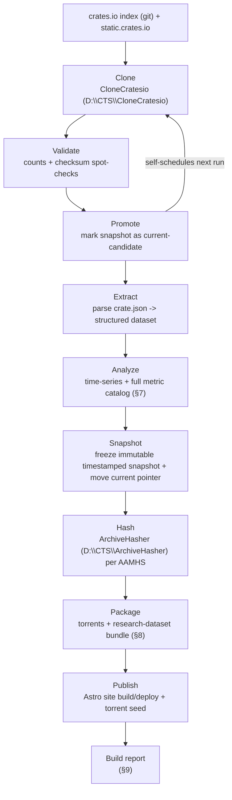

# PROJECT.md — rust.aptlantis.net

Status: concept | Proposal standard: PPS | Maintainer: Herb | Drafted: 2026-07-09 | Revised: 2026-07-09

## 1. Mission

`rust.aptlantis.net` is a static, self-hosted mirror of the crates.io registry — every crate, every version, including yanked releases — kept within roughly 12 hours of upstream. On top of the raw mirror sits an Astro-built statistics site that turns each sync into a growing time series: crate growth, yanked-vs-active ratios, publish velocity, dependency trends. The mirror is also republished on a regular cadence as torrent distributions, so the dataset is durable and shareable independent of any single host.

It's part of the APTlantis family of package mirrors.

**The mirror is raw material, not the product.** The actual deliverables are: the analytics built on top of it, the historical archive (immutable, timestamped snapshots — §4), the signed provenance record for each snapshot (ArchiveHasher/AAMHS), the torrent distributions, and periodic research-dataset releases aimed at people studying the ecosystem rather than just consuming crates (§8). That framing drives most of the design decisions below: the pipeline doesn't just refresh "the current mirror," it produces an append-only sequence of verifiable, analyzable snapshots — closer to an observatory than a mirror.

## 2. Proven baseline

The downloader component isn't hypothetical — it's already been run at target scale: **2.5 million records synced in ~2.5 hours at 100% accuracy** (Go implementation, CloneCratesio). That result is the basis for the freshness SLA below; a full resync fits comfortably inside a 12-hour window with headroom for retries and verification.

## 3. Architecture at a glance

The pipeline is a staged workflow, not a monolithic job. Each stage consumes only the artifacts the previous stage produced, which is what makes the whole thing recoverable: if packaging fails, you re-run packaging, not the clone.



This project is not standalone — it composes sibling APTlantis components by path, not by re-implementing them:

| Path | Role | Relationship to this project |
|---|---|---|
| `D:\CTS\CloneCratesio` | Performs the actual crates.io clone (index + `.crate` files, yanked-aware) | Invoked by the pipeline's Clone stage — the proven "2.5M records / 2.5h / 100% accuracy" tool referenced in §2 |
| `D:\.library\aptlantis_core\AAMHS` | Governing standard: dictates how hashing and signing for long-term archival must be done | Governs how ArchiveHasher is invoked and what its output must contain; not a tool itself |
| `D:\CTS\ArchiveHasher` | Performs the hashing/signing called for by AAMHS | Invoked by the pipeline's Hash stage, after Snapshot and before Package |

## 4. Immutable snapshot model

Every completed run produces an immutable, timestamped snapshot — it is written once and never modified afterward:

```text
snapshots/
  2026-07-09T00-00Z/
  2026-07-09T12-00Z/
  2026-07-10T00-00Z/
current -> snapshots/2026-07-10T00-00Z/   (pointer/manifest, not a copy)
```

"Current" is just a pointer (symlink or a small manifest file naming the latest snapshot) — it's the only thing that changes on a normal run. This gives the project:

- **Reproducibility** — any historical state of the mirror can be reopened exactly as it was.
- **Historical comparison** — analytics can diff snapshot N against snapshot N-1 instead of only tracking running totals.
- **Rollback** — a bad run (failed validation, corrupted extract) never touches prior snapshots; roll back by moving the pointer.
- **Forensic verification** — combined with ArchiveHasher/AAMHS, each snapshot carries its own hash/signature, so anyone can verify a specific point-in-time snapshot independent of the live site.
- **Immutable torrent versions** — each packaged torrent maps to exactly one snapshot and never mutates after publication, which is a property torrents need anyway (mutating a published torrent breaks it for existing peers).

Retention/pruning policy for old snapshots is still open — see §10.

## 5. Components

### CloneCratesio — `D:\CTS\CloneCratesio` (existing, proven, external)

- Sibling project, not part of this repo. Pulls the crates.io index (crate.json per crate) and the corresponding `.crate` tarballs from static.crates.io.
- Captures yanked status per version, not just current-latest.
- Already validated at full scale (2.5M records, 100% accuracy) — this component is a known quantity, not a design risk.
- Invoked by the pipeline's Clone stage as a subprocess/job, not by cron.

### Rust Pipeline (new — the core build)

Not a single binary doing everything — a sequence of stages, each with a defined input/output contract:

| Stage | Consumes | Produces | Notes |
|---|---|---|---|
| Clone | Last snapshot's state (for delta) | Raw `crate.json` + `.crate` files | Delegates to CloneCratesio |
| Validate | Raw clone output | Pass/fail + counts/checksum report | Nothing is promoted on failure |
| Promote | Validated raw output | Current-candidate marked | Last point before the snapshot is considered real |
| Extract | Promoted raw files | Structured dataset (versions, yank flags, dependency edges) | Parses `crate.json` |
| Analyze | Structured dataset + prior snapshots | Time-series + full metric catalog (§7) | Needs history, not just current state |
| Snapshot | Extract + Analyze output | Immutable `snapshots/<timestamp>/` + moved `current` pointer | See §4 |
| Hash | Frozen snapshot | Hash/signature manifest | Delegates to ArchiveHasher, per AAMHS |
| Package | Snapshot + hash manifest | Torrents + research-dataset bundle (§8) | |
| Publish | Package output | Deployed Astro site + seeded torrents | |

- **Scheduler**: replaces cron. A long-running process (or a self-re-invoking binary under a simple process supervisor in Docker) tracks last-sync time and target freshness (≤12h) and triggers the next Clone itself.
- **Recoverability**: because each stage only reads the prior stage's artifacts, a failure at Package doesn't require re-running Clone/Validate/Extract/Analyze — just re-run from Package forward against the already-frozen snapshot.
- **Reporting**: every run — successful or not — emits a build report (§9).

### ArchiveHasher — `D:\CTS\ArchiveHasher` (existing, external)

- Sibling project, not part of this repo. Performs the hashing and signing of a frozen snapshot for long-term archival, per the rules dictated by the AAMHS standard (`D:\.library\aptlantis_core\AAMHS`).
- Invoked by the pipeline's Hash stage, once per snapshot, after Snapshot and before Package.
- Its output (a hash/signature manifest) doubles as the integrity/provenance record bundled into torrent distributions and research-dataset releases — this is the leading candidate for the "security information" mentioned in §10, pending confirmation of whether vulnerability-advisory data (e.g. RustSec) is wanted in addition.

### Astro Site (stats/analytics + mirror browsing)

- Built with **Astro**, statically generated from the pipeline's dataset output — no live backend/database serving requests.
- Three blended surfaces:
  - **Mirror browsing**: crate/version listing, yanked markers, download links into the static mirror storage.
  - **Analytics**: the full metric catalog in §7, charted as Astro islands (e.g. Chart.js/D3) hydrated against the pipeline's precomputed JSON, not client-side recomputation of 2.5M records.
  - **Mirror health**: a "Latest Sync" status page driven by the build report (§9).
- Rebuilt each sync cycle; deployed as static output (any static host/CDN in front of it).

### Torrent Packager

- Per snapshot, packages the full mirror (crate files) plus the hash/signature manifest into torrent(s), with smaller breakdown torrents for partial downloads, and separately assembles the periodic research-dataset bundle (§8).
- Every torrent maps to exactly one immutable snapshot and is never re-published mutated.
- Granularity of the smaller breakdowns is still open — see §10.

## 6. Data model

| Artifact | Produced by | Purpose |
|---|---|---|
| Raw `crate.json` + `.crate` files | Clone stage (CloneCratesio) | Ground truth mirror content, source for everything downstream |
| Structured dataset (versions, yank flags, dependency edges) | Extract stage | Query-ready representation of the mirror for the site and for torrent/dataset manifests |
| Time-series + metric catalog | Analyze stage | Historical basis for the analytics in §7 |
| Immutable snapshot (`snapshots/<timestamp>/`) | Snapshot stage | Frozen, reproducible point-in-time state of the whole mirror + dataset |
| `current` pointer | Snapshot stage | Names the latest snapshot; the only mutable thing in the snapshot store |
| Hash/signature manifest | Hash stage (ArchiveHasher, per AAMHS) | Long-term archival integrity/provenance record; bundled into torrents and research datasets |
| Build report / run manifest | Every stage (append-only) | Audit trail and the data source for the site's Mirror Health page (§9) |
| Astro static build output | Publish stage | The deployed public site |
| `rust.aptlantis.schema.toml` | In place (replaces `Aptlantis.manifest.toml`) | Project manifest for this repo; currently mirrors the generic APTlantis manifest fields under a project-specific filename — whether it should also define the crate dataset schema is still open (see §10) |
| Torrent + magnet files | Package stage | Distributable copies of a single immutable snapshot and its subsets |
| Research-dataset bundle | Package stage | Periodic, self-contained researcher-facing release (§8) |

## 7. Analytics catalog

Because every run is a snapshot with full history behind it, the site isn't limited to current-state totals. Planned metrics:

- Crates added / crates that disappeared
- Yanked versions and yank events over time (yanked-vs-active, yanked-vs-new)
- Publish velocity and release frequency per crate / per maintainer
- Most active maintainers by publish volume
- Dependency-graph growth over time
- Ecosystem growth by year
- SemVer adoption patterns
- MSRV trends (eventually — requires parsing more than the index provides)
- License distribution
- Download acceleration (if/when download-count data is available)
- Dormant crates (no releases in N months/years)
- Revivals (a dormant crate publishing again after a long gap)

This list is a starting catalog, not a final spec — it will grow as the time-series accumulates enough history to make some of these meaningful (e.g. "revival after years of inactivity" needs years of snapshots first).

## 8. Research dataset releases

In addition to the raw-mirror torrent, the Package stage periodically assembles a single, self-contained, versioned research release — one thing to download instead of millions of small files:

```text
Rust Ecosystem — July 2026 Snapshot
  crate metadata
  dependency graph
  yanked history
  hashes
  signatures
  analytics (the §7 catalog, computed as of this snapshot)
  changelog (diff vs. the previous research release)
  torrent
```

Each research release corresponds to exactly one immutable snapshot (§4), so it's reproducible and independently verifiable via the hash/signature manifest. Cadence (monthly? quarterly?) and exact bundle contents are still open — see §10.

## 9. Pipeline health / build reports

Every run — successful, partial, or failed — emits a build report:

```text
Run ID
Started / Finished / Duration

New crates / Updated crates / Yanked versions

Validation: passed | failed (+ detail)
Snapshot: written | skipped
Hash/signature: verified | failed
Website: generated | failed
Torrent: generated | failed

Status: healthy | degraded | failed
```

Build reports are append-only and are the data source for an Astro "Latest Sync" / "Mirror Health" page, e.g.:

```text
Latest Sync — Completed in 2h 31m
2,503,944 versions · 0 validation failures
Current freshness: 4h 12m
Mirror Health: 98/100
```

This turns "is the mirror trustworthy right now" into something anyone can check at a glance, rather than something only the maintainer can infer from logs.

## 10. Open questions (not yet worked out)

These were explicitly flagged as undecided and should be resolved before implementation locks in:

- **Torrent granularity**: full-snapshot torrent is clear; the "smaller breakdowns" aren't defined yet (by date range? by crate popularity? integrity-manifest-only bundle?).
- **Security information source**: ArchiveHasher's hash/signature manifest (per AAMHS) covers integrity/provenance; still unconfirmed whether vulnerability-advisory data (e.g. RustSec) should also be bundled.
- **Seeding/hosting for torrents**: who/what seeds them long-term (self-hosted tracker vs. public trackers vs. WebSeed only).
- **Storage backend** for the raw mirror at 2.5M-record scale (plain filesystem vs. object storage) — affects Clone, Snapshot, and Package stage design, and snapshot storage cost over time.
- **Snapshot retention**: how long immutable snapshots are kept before pruning/cold-archiving, and whether pruning ever applies to research-dataset releases (probably not, given they're meant to be citable).
- **Research-dataset cadence and exact bundle contents**: monthly vs. quarterly vs. milestone-driven; final field list per bundle.
- **Mirror Health scoring**: what "98/100" is actually computed from — needs a defined rubric, not just a vibe number.
- **`rust.aptlantis.schema.toml` scope**: the file now exists (replacing `Aptlantis.manifest.toml`), but it currently just carries over the generic manifest fields — whether it should also define the crate dataset schema (versions, yank flags, dependency edges) itself, or stay purely a governance manifest, is still open.

## 11. Roadmap

- [x] Stand up the pipeline skeleton with explicit stages (Clone → Validate → Promote → Extract → Analyze → Snapshot → Hash → Package → Publish) and a scheduler driving Clone. — `pipeline/` (Rust crate `rust-aptlantis-pipeline`); stages are stubs (no real logic yet), scheduler always says "run now." Builds and runs clean.
- [ ] Define the structured dataset schema and time-series storage.
- [ ] Implement the immutable snapshot store + `current` pointer (§4).
- [ ] Wire in ArchiveHasher invocation (per AAMHS) as the Hash stage.
- [ ] Define the build report schema and make every stage emit to it (§9).
- [ ] Decide and implement the final structure of `rust.aptlantis.schema.toml` (already in place as the manifest, but not yet schema-bearing).
- [ ] Astro site: mirror-browsing pages against a fixture dataset.
- [ ] Astro site: first analytics charts (growth, yanked-vs-new) against real synced data.
- [ ] Astro site: "Latest Sync" / Mirror Health page against real build reports.
- [ ] Resolve remaining open questions in §10, then design the torrent packager and research-dataset bundle format.
- [ ] Containerize (Docker) and confirm end-to-end sync fits the 12h freshness SLA in practice.

## 12. Freshness & accuracy commitments

- **Freshness target**: mirror never more than ~12 hours stale.
- **Accuracy target**: matches CloneCratesio's proven 100% accuracy baseline; the Validate stage checks counts/checksums before anything is promoted.
- **Effort target**: routine syncs should be near-zero-touch — the self-scheduling pipeline, not a human, decides when to run.
