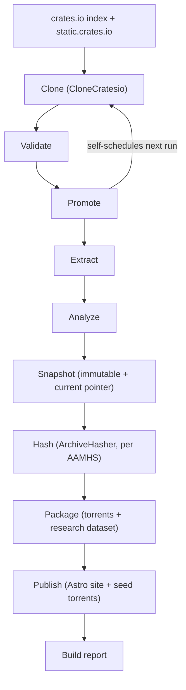

# rust.aptlantis.net


rust.aptlantis.net is a static, self-hosted mirror of the crates.io registry (every crate, every version, including yanked releases), kept within ~12 hours of upstream, with an Astro-built analytics site layered on top and periodic torrent + research-dataset distributions of the full history. It's part of the APTlantis family of package mirrors.

The mirror itself is raw material, not the product. The actual deliverables are the analytics, an immutable historical archive (timestamped, never-mutated snapshots), signed provenance records for each snapshot, torrent distributions, and periodic research-dataset releases for people studying the Rust ecosystem rather than just consuming crates.

This repo currently holds the design proposal plus the first runnable pipeline contract layer (`pipeline/`). The stage order exists, runs end-to-end, validates prior-stage artifacts, writes per-stage manifests, freezes a contract snapshot under `data/snapshots/<run_id>/`, moves `data/current.json`, and persists a JSON build report. The stages are still **contract-only**: CloneCratesio, ArchiveHasher, torrent creation, and Astro publishing are not invoked yet. This project composes two existing sibling APTlantis components rather than reimplementing them: [`CloneCratesio`](#components) (the proven downloader, see Verified Result below) and [`ArchiveHasher`](#components) (hashing/signing for archival, governed by the `AAMHS` standard). The project's manifest also lives under a project-specific name, `rust.aptlantis.schema.toml`, in place of the usual `Aptlantis.manifest.toml`.

Quick links: [Architecture & full proposal](PROJECT.md) | [Mockup notes](docs/mockups/rust-aptlantis-ux-notes.md) | [Static mockup storyboard](docs/mockups/rust-aptlantis-storyboard.html)

---

## What This Project Covers

| Area | Summary |
|------|---------|
| Mirror sync | `CloneCratesio` (`D:\CTS\CloneCratesio`) pulls the crates.io index + `.crate` files, including yanked versions |
| Orchestration | A staged pipeline (Clone → Validate → Promote → Extract → Analyze → Snapshot → Hash → Package → Publish) self-schedules syncs — no cron |
| Immutable archive | Every run freezes a timestamped snapshot that's never modified again; `current` is just a pointer to the latest one |
| Archival integrity | `ArchiveHasher` (`D:\CTS\ArchiveHasher`) hashes and signs each snapshot per the `AAMHS` standard |
| Analytics site | Astro static site: mirror browsing, a growing metric catalog (growth, yanked history, maintainer activity, dormancy/revival, etc.), and a Mirror Health status page |
| Distribution | Per-snapshot torrents plus periodic, self-contained research-dataset releases |
| Audit trail | A build report per run (counts, validation, statuses) backs both the audit log and the site's health page |

---

## Verified Result

| Metric | Value |
|--------|-------|
| Records synced | `2,500,000` |
| Duration | `~2.5 hours` |
| Accuracy | `100%` |
| Component | CloneCratesio (`D:\CTS\CloneCratesio`) |
| Result | CloneCratesio already meets the throughput and accuracy needed to hit a 12h freshness SLA with headroom |

This is a prior result from the downloader component, not yet a result of this project's contract-only pipeline end-to-end. See [PROJECT.md](PROJECT.md) §2 and §12.

---

## Architecture at a Glance



Each stage only consumes the previous stage's artifacts, so a failure partway through (say, torrent packaging) doesn't require re-running the clone. Full rationale and open questions: [PROJECT.md](PROJECT.md).

---

## Components

### `CloneCratesio` (existing, proven, external — `D:\CTS\CloneCratesio`)

Sibling project. Pulls the crates.io index and `.crate` files, capturing yanked status per version.

- Already validated at scale: 2.5M records / 2.5h / 100% accuracy
- Invoked by the pipeline's Clone stage, not by cron
- No new development needed to reach v1 — reuse as-is

### `Pipeline` (new)

A staged workflow engine, not a script: Clone → Validate → Promote → Extract → Analyze → Snapshot → Hash → Package → Publish. Self-schedules the next run instead of relying on cron, and freezes an immutable snapshot on every completed run (see [PROJECT.md](PROJECT.md) §4).

Current implementation status:

- `cargo run` executes all nine stages in order.
- Stages validate that the expected previous-stage artifact exists before continuing.
- Each stage writes `data/runs/<run_id>/<stage>/artifact.json`.
- Snapshot writes `data/snapshots/<run_id>/snapshot.json` and atomically replaces `data/current.json`.
- Hash/Package/Publish create contract directories for integrity manifests, torrents/research datasets, and site output.
- The runner writes `data/reports/<run_id>.json`.
- `RUST_APTLANTIS_DATA_ROOT` can override the default `./data` output root.

### `ArchiveHasher` (existing, external — `D:\CTS\ArchiveHasher`)

Sibling project. Hashes and signs each frozen snapshot for long-term archival, per the `AAMHS` standard (`D:\.library\aptlantis_core\AAMHS`).

- Its hash/signature manifest is the leading candidate for the "security information" bundled into torrents and research datasets
- Whether vulnerability-advisory data (e.g. RustSec) is also wanted alongside it is still open

### `Astro Site` (new)

Static, statistics-heavy front end built with Astro.

- Mirror browsing: crate/version listing, yanked markers
- Analytics: a growing metric catalog — growth, yanked-vs-new, maintainer activity, dependency-graph growth, SemVer/license trends, dormant/revived crates, and more (full list in [PROJECT.md](PROJECT.md) §7)
- Mirror Health: a "Latest Sync" status page driven by each run's build report
- Rebuilt from the pipeline's dataset each sync cycle — no live backend

---

## Data, Storage, or Artifact Model

| Artifact | Purpose |
|----------|---------|
| `crate.json` + `.crate` files | Raw mirror content — ground truth |
| `data/runs/<run_id>/<stage>/artifact.json` | Contract artifact emitted by each pipeline stage; currently placeholder metadata, later the handoff point for real stage outputs |
| Structured dataset | Query-ready versions/yank/dependency data |
| Immutable snapshot (`snapshots/<timestamp>/`) | Frozen, reproducible point-in-time state of the whole mirror + dataset |
| `current.json` | Mutable pointer naming the latest frozen snapshot; used instead of mutating snapshot content |
| Hash/signature manifest | Long-term archival integrity record (ArchiveHasher, per AAMHS) |
| Build report (`data/reports/<run_id>.json`) | Per-run audit trail; backs the site's Mirror Health page |
| `rust.aptlantis.schema.toml` | In place, replacing `Aptlantis.manifest.toml`; still mirrors the generic manifest fields, dataset-schema role TBD |
| Torrent + magnet files | Distributable copies of a single immutable snapshot |
| Research-dataset bundle | Periodic, self-contained researcher-facing release (metadata + dependency graph + yanked history + hashes + signatures + analytics + changelog + torrent) |

Full data model: [PROJECT.md](PROJECT.md) §6.

---

## Open Questions

Not yet resolved — tracked in [PROJECT.md](PROJECT.md) §10:

- Torrent breakdown granularity (by date, by popularity, integrity-manifest-only bundle?)
- Whether vulnerability-advisory data (e.g. RustSec) is wanted alongside ArchiveHasher's integrity manifest
- Torrent seeding/hosting strategy
- Storage backend for the raw mirror at 2.5M-record scale
- Snapshot retention/pruning policy (and whether research-dataset releases are ever pruned)
- Research-dataset cadence and exact bundle contents
- What the Mirror Health score is actually computed from
- Final structure/content of `rust.aptlantis.schema.toml` (now in place, replacing `Aptlantis.manifest.toml`, but still just carrying the generic manifest fields)

---

## Release Posture

rust.aptlantis.net is still pre-integration, but it now has a runnable pipeline contract layer plus two existing, reusable sibling components (CloneCratesio and ArchiveHasher).

| Field | Value |
|-------|-------|
| Stage | concept |
| Completion | 10% (design drafted; pipeline contract layer runs and emits artifacts; no real clone/hash/site/package integration yet) |
| Stability | experimental |
| Technical debt | none (pre-implementation) |
| Maintenance burden | unknown — TBD once pipeline exists |
| License | TBD |
| Maintainer | Herb |

---

## Roadmap

- [x] Pipeline skeleton with explicit stages (Clone → Validate → Promote → Extract → Analyze → Snapshot → Hash → Package → Publish) and a scheduler driving Clone — see `pipeline/`
- [x] First contract layer: per-stage artifacts, JSON build reports, immutable contract snapshot directory, and `current.json`
- [ ] Structured dataset schema + time-series storage
- [ ] Replace contract snapshot contents with real raw/dataset/analytics artifacts
- [ ] Wire in ArchiveHasher invocation (per AAMHS) as the Hash stage
- [ ] Expand build report schema with real counts, validation results, health scoring, and failure details
- [ ] Decide the final structure of `rust.aptlantis.schema.toml` (already in place, but not yet schema-bearing)
- [ ] Astro site: mirror browsing against a fixture dataset
- [ ] Astro site: first analytics charts against real synced data
- [ ] Astro site: Latest Sync / Mirror Health page against real build reports
- [ ] Resolve remaining open questions above, then design the torrent packager and research-dataset bundle format
- [ ] Containerize and confirm end-to-end sync fits the 12h SLA in practice

---

## License

TBD.

---

## Author

Maintained by Herb.

```html
<script type="application/ld+json">
{
  "@context": "https://schema.org",
  "@type": "SoftwareSourceCode",
  "name": "rust.aptlantis.net",
  "description": "Static, continuously-synced, immutably-snapshotted mirror of the crates.io registry with an Astro-built analytics site, signed archival provenance, torrent distribution, and periodic research datasets.",
  "programmingLanguage": ["Rust", "Go", "Astro"],
  "author": {
    "@type": "Person",
    "name": "Herb"
  }
}
</script>
```
